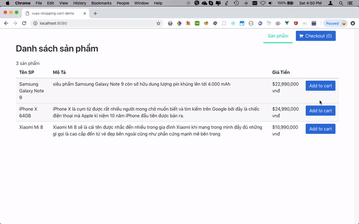

# vuex-shopping-cart-demo

> Demo shopping cart with vue, vuex, vue-router project

## List packages 
- vue-router
- vuex
- accounting-js

## Build Setup

``` bash
# install dependencies
npm install

# serve with hot reload at localhost:8080
npm run dev

# build for production with minification
npm run build
```

# Demo


# How to deploy code to Netlify
- See [Hưỡng dẫn deploy Vue project lên Netlify](https://convoicoi.wordpress.com/2018/09/14/vuejs-huong-dan-deploy-vue-project-len-netlify/)

For detailed explanation on how things work, consult the [docs for vue-loader](http://vuejs.github.io/vue-loader).
